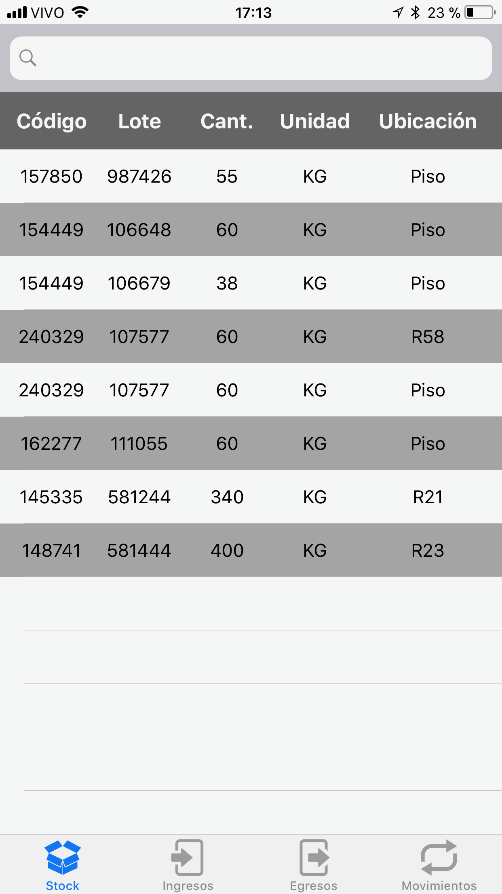
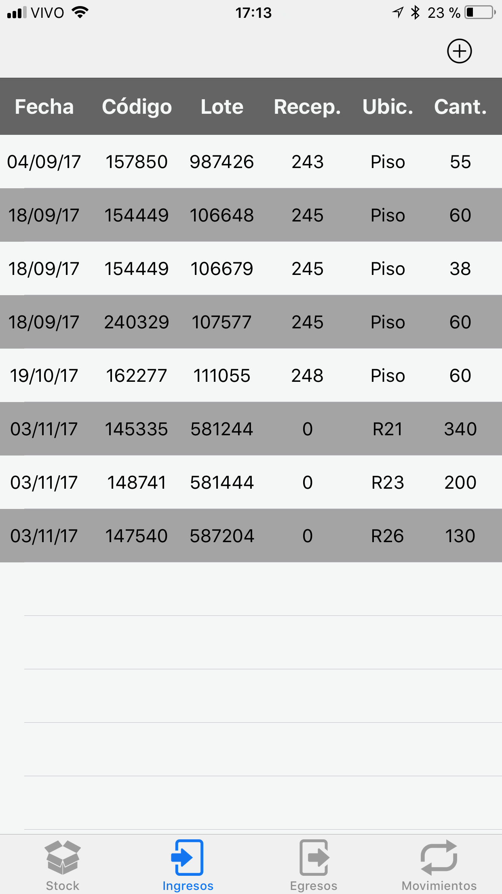

<h1> StockeAR</h1>

StokeAR es una aplicación que permite una administración rápida y eficiente de un depósito.

 

<h2>Features</h2>

&emsp;&bull;&ensp; Visualizar el stock actual y realizar búsquedas de los productos. 
&emsp;&bull;&ensp;   Ingresar productos usando la cámara de fotos como scanner para códigos QR. 
&emsp;&bull;&ensp;   Asignar la ubicacion de los ingresos usando el código de barras de la ubicación. 
&emsp;&bull;&ensp;   Realizar egresos buscando el producto para conocer la ubicación. 
&emsp;&bull;&ensp;   Reubicar productos dentro del depósito bucando por código. 
&emsp;&bull;&ensp;   Asignar la nueva posición usando el código de barras de la ubicación. 

<h2>Producto</h2>

 

 

 

<h2>Depósito</h2>

 

 

<h2>Stock</h2>
Aquí se pueden buscar los productos en stock.

 

 

<h2>Ingresos</h2>
Aquí se pueden ingresar la mercadería entrante al stock.

 

